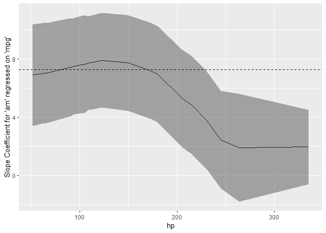

<!-- README.md is generated from README.Rmd. Please edit that file -->

[](https://travis-ci.org/ddsjoberg/sjosmooth)
[](https://ci.appveyor.com/project/ddsjoberg/sjosmooth)
[](https://codecov.io/github/ddsjoberg/sjosmooth?branch=master)

# sjosmooth

The goal of sjosmooth is to provide kernel smoothed estimates for time
to event data.

## Installation

You can install the released version of sjosmooth from GitHub with:

``` r
remotes::install_github("ddsjoberg/sjosmooth")
```

## Example

This is a basic example which shows you how to solve a common problem:

``` r
library(sjosmooth)
library(dplyr)
#> 
#> Attaching package: 'dplyr'
#> The following objects are masked from 'package:stats':
#> 
#>     filter, lag
#> The following objects are masked from 'package:base':
#> 
#>     intersect, setdiff, setequal, union
library(tidyr)
library(ggplot2)
sm_beta_interaction(
 data = mtcars,
 method = "lm",
 formula = mpg ~ am ,
 interaction = "hp"
) %>% 
  select(point, model_tidy) %>% 
  unnest(point) %>% 
  unnest(model_tidy) %>% 
  ggplot(aes(x = hp, y = estimate)) + 
  geom_line() + 
  geom_ribbon(aes(ymin = conf.low, ymax = conf.high), alpha = 0.5)
#> Warning in qt(a, object$df.residual): NaNs produced
```


